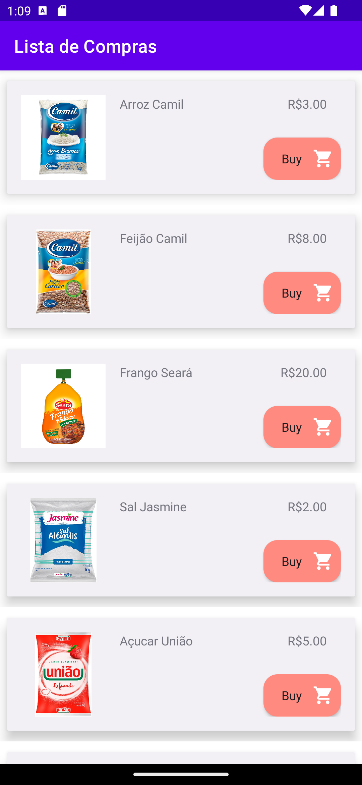
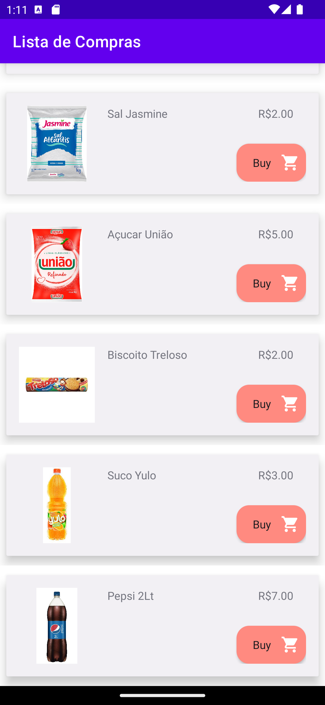

<h1 align="center">ShoppingList</h1>

<p align="center">
  <a href="https://opensource.org/licenses/Apache-2.0"></a>
  <a href="https://android-arsenal.com/api?level=23"></a>
  <br>
  <a href="https://wa.me/+5571991154541"></a>
  <a href="https://www.linkedin.com/in/emerson-dos-santos-silva-398319206/"></a>
  <a href="mailto:emersonsantos1921@gmail.com"></a>
</p>

<p align="center">  

⭐ Esse é um projeto para demonstrar meu conhecimento técnico no desenvolvimento Android nativo com Kotlin. Mais informações técnicas abaixo.

Aplicativo que mostra uma listagem de produtos que permite efetuar uma compra e demonstra uma tela de conclusão quando efetuada.

</p>

</br>

<p float="left" align="center">



</p>

## Download

Faça o download da <a href="apk/app-debug.apk?raw=true">APK diretamente</a>. Você pode ver <a href="https://www.google.com/search?q=como+instalar+um+apk+no+android">aqui</a> como instalar uma APK no seu aparelho android.

## Tecnologias usadas e bibliotecas de código aberto

- Minimum SDK level : 23
- [Linguagem Kotlin](https://kotlinlang.org/)

- Jetpack - LISTE O MÁXIMO DE COMPONENTES DO JETPACK QUE VOCÊ USA
  - Lifecycle: Observe os ciclos de vida do Android e manipule os estados da interface do usuário após as alterações do ciclo de vida.
  - ViewModel: Gerencia o detentor de dados relacionados à interface do usuário e o ciclo de vida. Permite que os dados sobrevivam a alterações de configuração, como rotações de tela.
  - ViewBinding: Liga os componentes do XML no Kotlin através de uma classe que garante segurança de tipo e outras vantagens.
  - Room: Biblioteca de abstração do banco de dados SQLite que garante segurança em tempo de compilação e facilidade de uso.
  - Custom Views: View customizadas feitas do zero usando XML.
  - [...]

- Arquitetura - LISTE BREVEMENTE OS COMPONENTES DA SUA ARQUITETURA UTILIZADA
  - MVVM (View - ViewModel - Model)
  - Comunicação da ViewModel com a View através de LiveData
  - Comunicação da ViewModel com a Model através de Kotlin Flow
  - Repositories para abstração da comunidação com a camada de dados.
  
- Bibliotecas - LISTE TODAS AS BIBLIOTECAS USADAS NO PROJETO, COM LINK E DESCRIÇÃO BREVE DO QUE ELA FAZ
  - [Retrofit2 & OkHttp3](https://github.com/square/retrofit): Para realizar requisições seguindo o padrão HTTP.
  - [Glide](https://github.com/bumptech/glide): Para carregamento de imagens e cacheamento das mesmas.
  - [Timber](https://github.com/JakeWharton/timber): Para registros de logs mais amigáveis que facilitam o debug.
  - [...]

## Arquitetura
APRESENTE A ARQUITETURA UTILIZADA NO PROJETO
**Nome do aplicativo** utiliza a arquitetura MVVM e o padrão de Repositories, que segue as [recomendações oficiais do Google](https://developer.android.com/topic/architecture).
</br></br>
ADICIONE UM FLUXOGRAMA DA ARQUITETURA UTILIZADA - https://excalidraw.com/
<br>

## Features

### Listagem de produtos


Listagem de produtos utilizando o recycler view, Layout de card criado usando Cardview e Constraint Layout.

### Conclusão da compra


Conclusão de compra utilizando botões interativos e múltiplas telas seguindo o ciclo de vida de uma Activity.

# Licença

```xml
   Copyright [2023] [Emerson Dos Santos]

   Licensed under the Apache License, Version 2.0 (the "License");
   you may not use this file except in compliance with the License.
   You may obtain a copy of the License at

   http://www.apache.org/licenses/LICENSE-2.0

   Unless required by applicable law or agreed to in writing, software
   distributed under the License is distributed on an "AS IS" BASIS,
   WITHOUT WARRANTIES OR CONDITIONS OF ANY KIND, either express or implied.
   See the License for the specific language governing permissions and
   limitations under the License.
```
